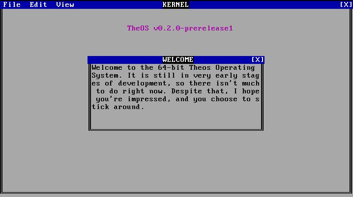

# TheOS

> In honor of [Terry A. Davis](https://en.wikipedia.org/wiki/Terry_A._Davis), 1969 - 2018


## Screenshot



---

## Table of Contents

- [Screenshot](#screenshot)
- [About](#about)
- [Features](#features)
- [Installation](#installation)
  - [Prebuilt iso](#prebuilt-iso)
  - [Build from source](#build-from-source)
    - [Packages](#packages)
  - [Usage](#usage)
- [License](#license)

## About

**Disclaimer: This operating system is still in very early stages of development. Please don't use this until a stable release is published.**

The 64-bit Theos Operating System was made because I want my own operating system, that's all. No unique backstory, I just want an operating system.

## Features

- 80x25 screen resolution
- Small codebase: only a few thousand lines
- Highly extensible: modular design makes customization easy
- Keyboard and video drivers
- Bare-metal, no-dependencies C and graphics libraries

## Installation

To install TheOS, you can download a [prebuilt iso](#prebuilt-iso), or [build an iso from source](#build-from-source).

### Prebuilt iso

You can download a prebuilt iso on any platform from the [releases](https://github.com/joshjkk/TheOS/releases) page.

### Build from source

**Currently, you can only build for Debian**

In order to build the iso from source, you are going to need to [install some packages](#package).

After installing the required packages, run the following command to build the iso into ```build/TheOS.iso```:

``` bash
sudo make debian
```

#### Packages

``` bash
sudo apt install nasm xorriso grub-pc-bin grub-common mtools libisoburn-dev libburn-dev qemu qemu-system-x86 build-essential
```

## Usage

Use the ```run.sh``` script to run the iso using QEMU.

## License

TheOS is under an Apache 2.0 license. More information can be found in the [LICENSE](./LICENSE) file.
