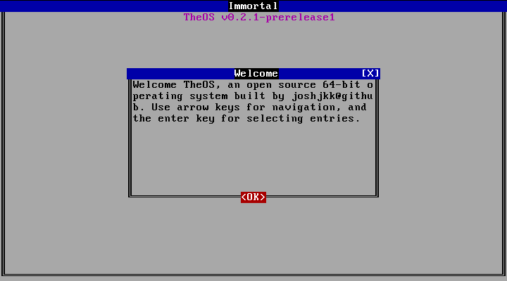

# TheOS

> In honor of [Terry A. Davis](https://en.wikipedia.org/wiki/Terry_A._Davis), 1969 - 2018

## About

**Disclaimer: This operating system is still in very early stages of development. Please don't use this until a stable release is published.**

The 64-bit Theos Operating System *(TheOS)* is an operating system tailored towards tinkerers who want complete control over their hardware. 

## Installation

To install TheOS, you can download a [prebuilt iso](#prebuilt-iso), or [build an iso from source](#build-from-source).

### Prebuilt iso

You can download a prebuilt iso on any platform from the [releases](https://github.com/joshjkk/TheOS/releases) page.

### Build from source

**Currently, you can only build for Debian**

In order to build the iso from source, you are going to need to [install some packages](#package).

### Packages

``` bash
sudo apt install nasm xorriso grub-pc-bin grub-common mtools libisoburn-dev libburn-dev qemu qemu-system-x86 build-essential
```

After installing the required packages, run the following command to build the iso into ```build/TheOS.iso```:

``` bash
sudo make debian
```

## Usage

Use the ```run.sh``` script to run the iso using QEMU.

## License

TheOS is under an Apache 2.0 license. More information can be found in the [LICENSE](./LICENSE) file.
